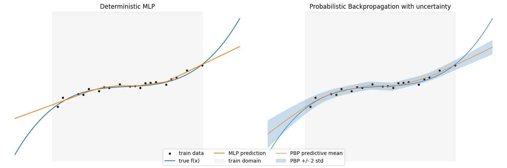
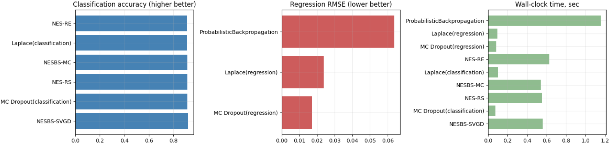

# Bensemble: Bayesian Ensembling in Practice

[Project](https://github.com/intsystems/bensemble/tree/master)

This blog is a guided tour of **Bensemble** - the library developed to implement and compare Bayesian deep learning model ensembling methods.

**Blog post by**: Muhammadsharif Nabiev, Fedor Sobolevsky

## Contents

- [Introduction](#introduction)
- [[#Library interface]]
	- [[#Ensemble class]]
	- [[#Uncertainty decomposition]]
	- [Metrics](#metrics)
- [Methods](#methods)
	- [[#Monte-Carlo Dropout]]
	- [[#Probabilistic Backpropagation]]
	- [[#Laplace approximation]]
	- [[#Practical variational inference]]
	- [[#Variational Rényi inference]]
	- [[#Neural Ensemble Search]]
	- [[#NES via Bayesian sampling]]
- [[#Seeing the methods in action]]
- [[#Conclusion]]


---
## Introduction

Imagine the usual story. You train a neat regression network, the validation curve behaves, the RMSE looks respectable. On the test set everything seems fine, so you feel safe. Then you move to slightly shifted data, or to some corner of the feature space that was barely covered during training, and suddenly the model is confidently wrong.

The issue is not only the prediction itself, but the lack of an honest “I don’t know.” A standard neural network gives a single parameter vector $\boldsymbol{\theta}^\star$ and a single prediction $f_{\boldsymbol{\theta}^\star}(\mathbf{x})$ for each input. All uncertainty is hidden inside early stopping heuristics, random seeds and architecture choices.

The Bayesian view starts from a simple observation: if there are many weight configurations that explain the data reasonably well, we should not pretend that one of them is the truth. Instead we keep a distribution over weights,

$$
p(\boldsymbol{\theta} \mid \mathcal{D}) \propto p(\boldsymbol{\theta})p(\mathcal{D} \mid \boldsymbol{\theta}),
$$

and make predictions by averaging over many plausible networks,

$$
p(y \mid \mathbf{x}, \mathcal{D})
= \int p(y \mid \mathbf{x}, \boldsymbol{\theta}) p(\boldsymbol{\theta} \mid \mathcal{D}) d\boldsymbol{\theta}.
$$

This already explains why Bayesian models tend to be more cautious off-distribution: if different networks in the posterior disagree, the averaged prediction becomes uncertain.

For deep networks this integral is intractable, so in practice we approximate the posterior with something tractable, call it $q(\boldsymbol{\theta})$, draw samples

$$
\boldsymbol{\theta}^{(1)},\dots,\boldsymbol{\theta}^{(M)} \sim q(\boldsymbol{\theta}),
$$

and treat them as an ensemble of models. Then we can make predictions using the ensemble as
$$
p(y \mid \mathbf{x}, \mathcal{D})
\approx \frac{1}{M} \sum_{m=1}^M p\bigl(y \mid \mathbf{x}, \boldsymbol{\theta}^{(m)}\bigr),
$$
with the uncertainty of the prediction being the variance of member predictions. Hence, the core theme of this project is the following: approximate posteriors over the weights of neural networks, sample model ensembles from each of them, and compare their uncertainty behavior in a controlled way. One can see this more clearly by this example. 



---

## Library interface

Let's look at how the main tools for Bayesian ensembling and uncertainty estimation are implemented in Bensemble.
### Ensemble class

The core component of Bensemble is, of course, the `Ensemble` class. This is an abstraction over an ensemble of predictors, whether deterministic (i.e. the models are pre-sampled and stored in the ensemble) or stochastic (i.e. model weights are sampled for each prediction).

The main methods of `Ensemble` are:

- `from_models`, `from_stochastic` and `from_posterior` — ensemble initialization methods. `from_models` simply makes an ensemble from a list of models. `from_stochastic` makes an implicit ensemble out of a model with stochastic forward passes. Finally, `from_posterior` makes an ensemble by sampling model from the given posterior source.

- `forward` (`Ensemble(...)`) — standard method for single prediction. This method uses the ensemble's specified `combiner` function to aggregate member predictions into one. If not specified, it defaults to simple averaging. 

- `predict_members` — make predictions with each ensemble member. These predictions can the be used to calculate the ensemble's aggregated predictions and their uncertainty.

Below is a simple example of an ensemble from a list of MLPs:

```python
from torch import nn
from bensemble.core.ensemble import Ensemble

def create_model():
	return nn.Sequential(
		nn.Linear(1, 16),
		nn.ReLU(),
		nn.Linear(16, 1),
	)

models = [create_model() for _ in range(5)]
ensemble = Ensemble.from_models(models) # Create ensemble from list of models

inputs = torch.randn(1)

prediction = ensemble(inputs) # Make prediction using ensemble
print('Ensemble prediction:', prediction)

member_predictions = ensemble.predict_members(inputs) # Make multiple predictions
print('Member predictions:', member_predictions)
```

### Uncertainty decomposition

Uncertainty of predictions on a given dataset comes from two sources:

1) **Aleatoric** uncertainty comes from the inherent randomness in data;
2) **Epistemic** uncertainty comes from lack of knowledge about the data distribution (e.g. due to limited data).

The goal of Bayesian machine learning is to reduce epistemic uncertainty while maintaining a truthful estimate of aleatoric uncertainty. 

We offer functions for uncertainty decomposition both for classification and regression tasks. Here is an example of uncertainty decomposition: 

```python
from bensemble.uncertainty.decomposition import decompose_classification_uncertainty

# Make predictions with each member
with torch.no_grad():
    member_logits = ensemble.predict_members(x_test)
member_probs = torch.softmax(member_logits, dim=-1)

# Decompose uncertainty
total, aleatoric, epistemic = decompose_classification_uncertainty(member_probs)

for i in range(10):
    print(f"Example {i+1} | Total: {total[i]:.4f} | Aleatoric: {aleatoric[i]:.4f} | Epistemic: {epistemic[i]:.4f}")
```

### Metrics

While the metrics for regression tasks are fairly straightforward (MSE, MAE, etc.), metrics that assess predictions with uncertainty for classification tasks are a bit more sophisticated. Fortunately, Bensemble has you covered here.

We implement the following metrics for classification evaluation in `bensemble.metrics`:

- **Negative log-likelihood (NLL)** is a self-explanatory metric — it's the mean of negative log-likelihoods for each classes probability. Lower is better. Implemented in `negative_log_likelihood`.

- The **Brier score** is the mean squared difference between the predicted probability distribution and the one-hot encoded true label. Lower is better. Implemented in `brier_score`.

- **Expected calibration error (ECE)** divides the confidence space into `n_bins` and measures the weighted absolute difference between the model's accuracy and confidence in each bin. Lower is better (0.0 means perfectly calibrated). Implemented in `expected_calibration_error`.

Here is an example on how to use these metrics with Bensemble:

```python
from bensemble.metrics import expected_calibration_error, brier_score, negative_log_likelihood

# Generate logits for prediction using ensemble
with torch.no_grad():
    member_logits = ensemble.predict_members(x_test)
ensemble_logits = member_logits.mean(dim=0)

# Make predictions with logits
ensemble_probs = torch.softmax(ensemble_logits, dim=-1)

# Calculate metrics
nll = negative_log_likelihood(ensemble_probs, y_test)
print(f"Negative log-likelihood: {nll:.4f}")

bs = brier_score(ensemble_probs, y_test)
print(f"Brier score: {bs:.4f}")

ece = expected_calibration_error(ensemble_probs, y_test, n_bins=15)
print(f"Expected Calibration Error: {ece:.4f}")
```

A more detailed demo of all of Bensemble's core methods and utilities can be found [here](https://github.com/intsystems/bensemble/blob/master/notebooks/deep_ensembles_tutorial.ipynb).

---
## Methods

The methods we implemented in Bensemble are:

* Monte-Carlo dropout
* A practical variational inference (PVI) scheme based on Bayesian linear layers;
* Variational Rényi inference;
* Laplace approximation;
* Probabilistic Backpropagation (PBP);
* Neural Ensemble Search (NES);
* A combination of NES with Bayesian sampling (NESBS).

All of the methods implemented as part of Bensemble target the same object $p(y \mid \mathbf{x}, \mathcal{D})$, but they approximate $p(\boldsymbol{\theta} \mid \mathcal{D})$ in very different ways.

### Monte-Carlo Dropout

[Monte-Carlo Dropout (MCD)](https://proceedings.mlr.press/v48/gal16.pdf) is the simplest of Bensemble's methods, yet it proves to be a powerful tool in many tasks. Suppose that we train a neural network using dropout, i.e. each weight is randomly deactivated with a fixed probability $p$:

$$
\tilde{w}_{ij} = w_{ij}\cdot \delta_{ij},\quad \delta_{ij}\sim \text{Bern}(p).
$$

The key idea is simple: after training a neural network with dropout, why don't we leave dropout on during evaluation? When sampling predictions multiple times, we effectively get predictions of an ensemble of models, each with its own weights activated or deactivated. Each model of the ensemble uses different combinations of features, which in practice creates the diversity required for effective uncertainty estimation. Therefore, despite its simplicity, Monte-Carlo dropout proves to be at least a strong baseline for uncertainty estimation tasks.

Monte-Carlo dropout is implemented in the `MCDropoutEnsembler` class in Bensemble. Visit our [MC dropout demo](https://github.com/intsystems/bensemble/blob/master/notebooks/mc_dropout_demo.ipynb) for an example on how to use it.

### Practical variational inference
The [practical variational inference (PVI)](https://papers.nips.cc/paper_files/paper/2011/file/7eb3c8be3d411e8ebfab08eba5f49632-Paper.pdf) component in the project follows the “Bayesian layers’’ approach: instead of treating the whole network as a single variational object, it replaces ordinary linear layers by Bayesian linear layers and adds a simple Gaussian likelihood on top.

Each weight in a linear layer is modeled as

$$
w_{ij} \sim \mathcal{N}(\mu_{ij}, \sigma_{ij}^2),
$$

with a fixed Gaussian prior $p(\mathbf{w})$. Instead of sampling each weight independently at every step, PVI uses the local reparameterization trick: it samples directly in activation space. For an input mini-batch, the pre-activation means and variances are

$$
\boldsymbol{\gamma} = \mathbf{x} \mathbf{W}*\mu^\top,
\qquad
\boldsymbol{\delta} = \mathbf{x}^2 \mathbf{W}*\sigma^2{}^\top + \text{bias term},
$$

and activations are drawn as

$$
\mathbf{z} = \boldsymbol{\gamma} + \boldsymbol{\varepsilon} \odot \sqrt{\boldsymbol{\delta}},
\quad
\boldsymbol{\varepsilon} \sim \mathcal{N}(\mathbf{0}, \mathbf{I}).
$$

The loss function is a standard variational one:

$$
\mathcal{L}
= \mathbb{E}_{q(\boldsymbol{\theta})}[-\log p(\mathcal{D} \mid \boldsymbol{\theta})] + \lambda_{\mathrm{KL}} D_{\mathrm{KL}}\bigl(q(\boldsymbol{\theta}) ,\Vert, p(\boldsymbol{\theta})\bigr),
  $$

where $p(\mathcal{D} \mid \boldsymbol{\theta})$ is a Gaussian likelihood with learnable noise scale and the KL term is a sum of closed-form divergences for each Bayesian linear layer. This is conceptually close to “Bayes by Backprop’’ (see below), but with a variance-reduction trick that makes training more stable.

After training, one can either keep sampling activations on the fly to get predictive distributions or freeze individual weight samples to obtain a more classical ensemble of deterministic networks.

Practical variational inference is implemented via the `BayesianLinear` layer class in Bensemble. Visit our [variational inference demo](https://github.com/intsystems/bensemble/blob/master/notebooks/intro_to_variational_inference.ipynb) for an example on how to use it.

### Variational Rényi inference

[Variational Rényi inference (VR)](https://arxiv.org/pdf/1602.02311) follows the idea of standard variational inference but replaces the usual KL divergence by a whole family of divergences indexed by a parameter $\alpha$.

Rényi’s $\alpha$-divergence between $p$ and $q$ is defined as

$$
D_\alpha(p \Vert q)
= \frac{1}{\alpha - 1}
\log \int p(\boldsymbol{\theta})^\alpha q(\boldsymbol{\theta})^{1-\alpha} d\boldsymbol{\theta}.
$$

When $\alpha \to 1$, this reduces to the familiar $D_{\mathrm{KL}}(p \Vert q)$. Different values of $\alpha$ emphasize different aspects of the posterior: some are more mass-covering, others more mode-seeking.

In the implemented version, the approximate posterior $q(\boldsymbol{\theta})$ is a factorized Gaussian over layer weights. The central quantity is the importance weight

$$
w(\boldsymbol{\theta}) = \frac{p(\boldsymbol{\theta}, \mathcal{D})}{q(\boldsymbol{\theta})},
$$

and the Rényi-style objective

$$
\mathcal{L}*\alpha(q)
= \frac{1}{1-\alpha}
\log \mathbb{E}_{q(\boldsymbol{\theta})} \bigl[
w(\boldsymbol{\theta})^{1-\alpha}
\bigr].
$$

This is approximated by Monte Carlo using samples $\boldsymbol{\theta}^{(k)}$ drawn via the reparameterization trick. When $\alpha = 1$, the bound collapses to the usual evidence lower bound (ELBO); for $\alpha \neq 1$, we get a continuum of alternative objectives.

Qualitatively, this gives a knob that controls how aggressive or conservative the variational approximation is. Once trained, sampling networks is as simple as drawing from the Gaussian $q(\boldsymbol{\theta})$ and plugging the sampled weights into the base model, just as in PVI.

Variational Rényi inference is implemented in the `VariationalRenyi` class in Bensemble. Visit our [variational Rényi demo](https://github.com/intsystems/bensemble/blob/master/notebooks/variatinal_renyi_demo.ipynb) for an example on how to use it.
### Laplace approximation

[Laplace approximation (LA)](https://openreview.net/pdf?id=Skdvd2xAZ) starts from a different point. Instead of designing a Bayesian method from scratch, you begin with a network that has already been trained in the usual deterministic way, with weight decay capturing the prior. Let

$$
\ell(\boldsymbol{\theta}) = -\log p(\boldsymbol{\theta} \mid \mathcal{D})
= -\log p(\boldsymbol{\theta}) - \log p(\mathcal{D} \mid \boldsymbol{\theta}) + \text{const},
$$

and let $\boldsymbol{\theta}^\star$ be the trained weights, approximately minimizing $\ell$.

Laplace assumes that, near $\boldsymbol{\theta}^\star$, the posterior can be approximated by a Gaussian. Expanding $\ell$ in a second-order Taylor series gives

$$
\ell(\boldsymbol{\theta}) \approx \ell(\boldsymbol{\theta}^\star) + \tfrac{1}{2} (\boldsymbol{\theta} - \boldsymbol{\theta}^\star)^\top \mathbf{H} (\boldsymbol{\theta} - \boldsymbol{\theta}^\star),
$$

with $\mathbf{H}$ a curvature matrix at $\boldsymbol{\theta}^\star$ (Hessian or Gauss–Newton). This corresponds to a Gaussian approximation

$$
q(\boldsymbol{\theta}) = \mathcal{N}\bigl(\boldsymbol{\theta}^\star, \mathbf{H}^{-1}\bigr).
$$

For modern neural networks, $\mathbf{H}$ is far too large to store explicitly, so we use a Kronecker-factored approximation layer-wise. Roughly speaking, for a linear layer with input activations $\mathbf{x}$ and pre-activation Hessian $\mathbf{H}_z$, the curvature block is approximated as

$$
\mathbf{H}_{\text{weights}}
\approx \mathbb{E}[\mathbf{x} \mathbf{x}^\top] \otimes \mathbb{E}[\mathbf{H}_z],
$$

a Kronecker product of two much smaller matrices. This structure makes it feasible to invert the covariance and to sample weight matrices for each layer.

The attractive part is that no special training procedure is required: you can take any existing MLP, fit a Laplace approximation around its optimum, and immediately turn it into a Bayesian ensemble by drawing curvature-aware perturbations of its weights.

Laplace approximation is implemented in the `LaplaceApproximation` class in Bensemble. For an example on how to use it, visit our [Laplace demo](https://github.com/intsystems/bensemble/blob/master/notebooks/laplace_demo.ipynb).

### Probabilistic Backpropagation

[Probabilistic Backpropagation (PBP)](https://arxiv.org/pdf/1502.05336) pushes the classical “uncertainty in weights” idea quite literally. Instead of a single value for each weight, PBP maintains a Gaussian

$$
w_i \sim \mathcal{N}(m_i, v_i),
$$

and similarly treats noise and weight precisions as random, with Gamma posteriors. It is implemented for regression with a Gaussian likelihood.

Conceptually, for each input $\mathbf{x}$ the network does not produce a single scalar $f_{\boldsymbol{\theta}}(\mathbf{x})$, but an approximate predictive distribution

$$
p(y \mid \mathbf{x}, q) \approx \mathcal{N}\bigl(y \mid \mu(\mathbf{x}), \sigma^2(\mathbf{x})\bigr),
$$

where $\mu(\mathbf{x})$ and $\sigma^2(\mathbf{x})$ arise from propagating means and variances through the network layers. Non-linearities such as ReLU are handled by moment-matching: we approximate the output of ReLU under a Gaussian input by another Gaussian whose mean and variance are computed analytically.

Learning then proceeds in an assumed density filtering style. For each data point, we take the current approximate posterior $q_{\text{old}}(\boldsymbol{\theta})$, multiply it by the likelihood of that point, and project the result back to the Gaussian family:

$$
q_{\text{new}}(\boldsymbol{\theta}) \propto q_{\text{old}}(\boldsymbol{\theta}) p(y \mid \mathbf{x}, \boldsymbol{\theta})
\quad \text{(projected back to Gaussians)}.
$$

The end result is a factorized Gaussian over weights plus Gamma distributions over hyperparameters. From that, sampling full networks is straightforward: draw weights from the Gaussians, plug them into a standard multilayer perceptron, and you have a concrete ensemble member.

PBP is implemented in the `ProbabilisticBackpropagation` class in Bensemble. For an example on how to use it, check out our [probabilistic backpropagation demo](https://github.com/intsystems/bensemble/blob/master/notebooks/pbp_probabilistic_backpropagation_test.ipynb).

### Neural Ensemble Search

All of the methods above have one common limitation: the architecture of the model is always predefined. But what if we could approximate predictions across multiple architectures and, moreover, find optimal architectures automatically? This is exactly what [Neural Ensemble Search (NES)](https://proceedings.neurips.cc/paper_files/paper/2021/file/41a6fd31aa2e75c3c6d427db3d17ea80-Paper.pdf) offers.

The method is based on the idea of neural architecture search (NAS): searching for the optimal model architecture in a predefined search space $\mathcal{A}$. For each selected architecture $\alpha_i \in \mathcal{A}$, the corresponding model $f_{\boldsymbol{\theta}_i,\alpha_i}$ is trained on the training set $\mathcal{D}_\text{train}$ and then validated on the validation set $\mathcal{D}_\text{val}$ to determine its quality. NES follows the same approach, but with ensembles instead of single models. The optimization objective for NES can be written as
$$
\min_{\alpha_1, \dots, \alpha_M \in \mathcal{A}} \mathcal{L}\!\left(\mathrm{Ensemble}(f_{\theta_1,\alpha_1}, \dots, f_{\theta_M,\alpha_M}),\, \mathcal{D}_{\mathrm{val}}\right)
$$$$
\text{s.t.} \quad \theta_i \in \operatorname*{arg\,min}_{\theta}\, \mathcal{L}(f_{\theta,\alpha_i}, \mathcal{D}_{\mathrm{train}}), \quad i = 1, \dots, M
$$The strategies for architecture searching and selection may vary. Standard NES offers two methods: random search (NES-RS) and regularized evolution (NES-RE). The first strategy simply selects $M$ best architectures to add to the ensemble from a pool of $K$ randomly sampled ones, while the second method applies mutations to selected architectures in order to update the population from which the ensemble is selected. Both methods are parallelizable and allow for highly diverse architecture selection, which can noticeably improve results obtainable by fixed architecture methods.

NES-RS and NES-RE are implemented in the `RandomSearcher` and `EvolutionarySearcher` classes correspondingly in Bensemble. For examples on how to use them, visit our [NES-RS](http://github.com/intsystems/bensemble/blob/master/notebooks/nes_rs_demo.ipynb) and [NES-RE demos](https://github.com/intsystems/bensemble/blob/master/notebooks/nes_re_demo.ipynb).

### NES via Bayesian Sampling

Despite all of its advantages, NES has one core downside: the prohibitive cost of training each model from the search group. Moreover, searching over the whole architecture space is extremely costly, but simple strategies like random search are really chance-based and can miss optimal architectures. 

[NES via Bayesian Sampling (NESBS)](https://proceedings.mlr.press/v180/shu22a/shu22a.pdf) aims to solve these problems. First, instead of training all models separately, it introduces a supernet that shares weights among all architectures in the search space. For training, the supernet uses uniform path sampling: in each training step, a single architecture is sampled from the net, and only its corresponding weights are updated. This provides a fair estimate of each architectures performance without separate training.

To characterize ensemble diversity, NESBS introduces a variational posterior over architectures:

$$
p_{\alpha}(\mathcal{A})\approx p(\mathcal{A} | \mathcal{D}).
$$

This variational posterior aims to maximize the likelihood of well-performing architectures. It can be learned by minimizing the evidence lower bound (ELBO) of the following form:

$$
\max_\alpha \mathbb{E}_{\mathcal{A}\sim p_{\alpha}(\mathcal{A})} [\log p(\mathcal{A}|\mathcal{D})] - KL[p_{\alpha}(\mathcal{A})|p(\mathcal{A})].
$$

Using the learned variational posterior, we can now sample the final set of architectures for our ensemble. NESBS proposes two methods for that:

- Monte-Carlo sampling - simply sampling randomly from the posterior;
- Stein variational gradient descent with regularized diversity (SVGD-RD) - controlled optimization of a set of architectures (particles) aiming to minimize the KL divergence to the target posterior while maintaining diversity at level $\delta$:
$$
q^* = \arg\min_{q\in\mathcal{Q}} \text{KL}(q\|p) + n\delta\mathbb{E}_{x, x' \sim q}[k(x, x')].
$$
Applying all of these tricks in practice helps NESBS become a more efficient alternative to standard NES while achieving comparable performance.

NESBS is implemented in the `NESBayesianSampler` class in Bensemble. Visit our [NESBS demo](https://github.com/intsystems/bensemble/blob/master/notebooks/NESBS_demo.ipynb) for an example on how to use it.

---

## Seeing the methods in action

The math above is intentionally light; the interesting part is how these methods actually behave on real data. The project notebooks are easiest way to see that. You can try out our [demos](https://github.com/intsystems/bensemble/tree/master/notebooks), which demonstrate each method's interface and capabilities, or check out our [benchmark notebook](https://github.com/intsystems/bensemble/blob/master/notebooks/benchmarks_new_methods.ipynb), where all of Bensemble's methods are compared on the same data. Here is a figure summarizing our benchmark test for all of Bensemble's methods.



Overall, different ensembling methods show their strengths in different applications, with some being generally more accurate while others being faster and simpler. Luckily, with Bensemble, you can easily try out multiple different methods for your task without having to change your code completely for each one of them.

---

## Conclusion

The project deliberately stays away from exotic new architectures. Instead it takes seven representative approximations to Bayesian neural networks, puts them into a shared interface, and asks a simple question: if we look at their predictions as ensembles, how do they differ in terms of uncertainty?

All of Bensemble's methods aim to solve the same task: approximate the Bayesian predictive distribution that averages over plausible parameter values instead of trusting a single network. The value of having them in a single codebase, with common interfaces and metrics, is that these differences stop being abstract and become visible: in calibration plots, in OOD behavior, and in how fast confidence grows once the model leaves the comfort zone of the training data.
