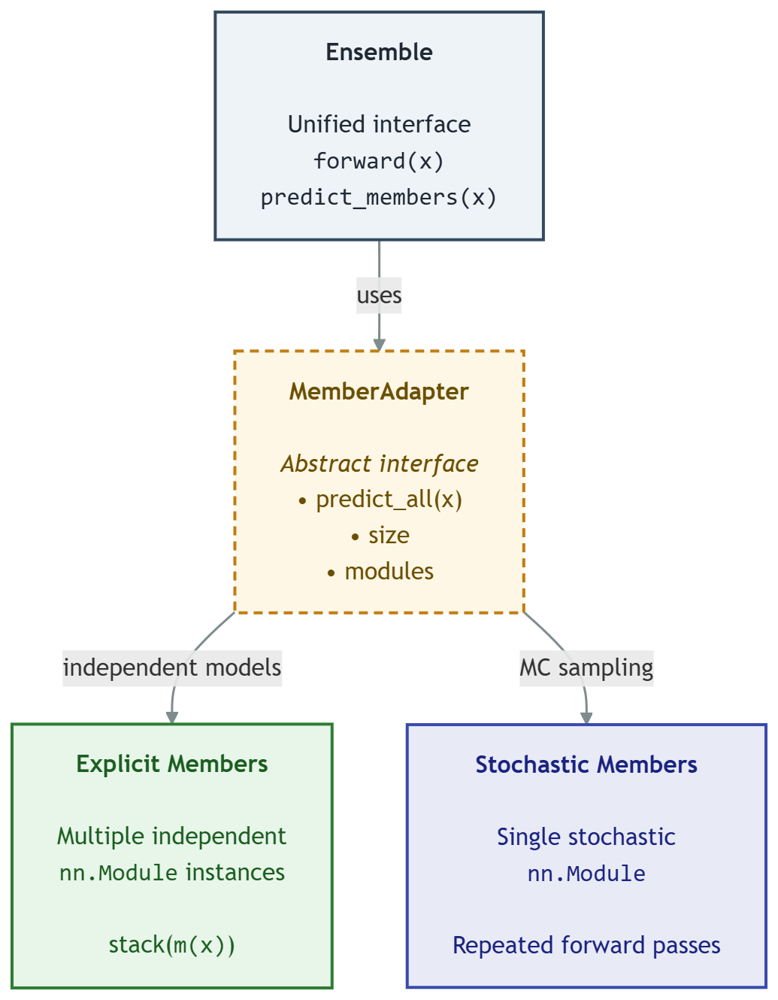

# Summary

Modern deep learning models are typically trained to produce a single point
prediction, with no indication of how much to trust that prediction. In many
research and decision-making settings — medical imaging, autonomous systems,
scientific measurement — knowing how uncertain a model is matters as much as
the prediction itself. `bensemble` is a Python library, built directly on top
of PyTorch, that provides a unified interface for quantifying and using this
uncertainty. It brings together several distinct families of methods:
explicit ensembling (Deep Ensembles [@lakshminarayanan2017simple]),
implicit/stochastic ensembling (Monte Carlo Dropout [@gal2016dropout],
variational Bayesian layers optimized via the standard evidence lower bound
or its Rényi-divergence generalization [@kingma2015variational;
@li2016renyi]), post-hoc posterior
approximations (Laplace approximation with Kronecker-factored curvature
[@ritter2018scalable], Probabilistic Backpropagation
[@hernandez2015probabilistic]), and ensemble/architecture search (Neural
Ensemble Search [@zaidi2021neural] via random search, regularized evolution,
and a sampler inspired by Stein Variational Gradient Descent
[@liu2016stein]) behind a single `Ensemble` abstraction. On top of this,
`bensemble` provides tools to decompose predictive uncertainty into
aleatoric and epistemic components, calibrate probabilistic predictions
(temperature and vector scaling), and evaluate calibration quality (Expected
Calibration Error, Brier score, negative log-likelihood). Researchers can
train models using ordinary PyTorch code and use `bensemble` for
inference-time uncertainty analysis without adopting a new training
framework.

# Statement of need

Uncertainty quantification (UQ) for deep learning is an active and
fragmented research area. Individual methods like Deep Ensembles
[@lakshminarayanan2017simple], MC Dropout [@gal2016dropout], variational
inference with the local reparameterization trick [@kingma2015variational],
Laplace approximations [@ritter2018scalable], and Neural Ensemble Search
[@zaidi2021neural] are each associated with their own reference
implementation, typically released as a standalone research artifact tied to
a single paper, with inconsistent APIs, inconsistent assumptions about
training loops, and little support for combining or comparing methods
side-by-side. A researcher who wants to ask a simple applied question
"which UQ method gives the best calibrated, best-separated in-distribution
vs. out-of-distribution uncertainty for my model, at what compute cost?",
currently has to reimplement or glue together several independent codebases,
each with different conventions for what a "member," a "sample," or a
"posterior" is.

`bensemble` is designed for exactly this audience: researchers and
practitioners who already have a working PyTorch training pipeline and want
to layer uncertainty estimation, calibration, and ensembling on top of it
without restructuring their code. Because the library treats "where
predictions come from" as an implementation detail behind a single
`Ensemble.predict_members` interface, switching between, e.g., Deep
Ensembles and MC Dropout in an evaluation script requires changing a single
constructor call rather than rewriting the evaluation logic.

# State of the field

The closest existing work is `torch-uncertainty` [@lafage2025torchuncertainty],
a substantially larger and more mature PyTorch-based UQ library covering
more methods (including BatchEnsemble, Masksembles, MIMO, and Packed
Ensembles) and more tasks (classification, regression, segmentation, depth
estimation) than `bensemble`. It does not, however, include Neural Ensemble
Search or Probabilistic Backpropagation, and its training/evaluation
routines are built around PyTorch Lightning, which requires adopting its
routine-based training abstraction rather than layering onto an existing
plain-PyTorch training loop. `bensemble`'s design deliberately avoids this:
it treats the training loop as the user's own code and only wraps
inference-time prediction and uncertainty analysis, at the cost of a
narrower method/task scope than `torch-uncertainty`.

Other existing tools address related but narrower parts of the same
problem. `laplace-torch` [@daxberger2021laplace] provides a mature, focused
implementation of Laplace approximations for PyTorch models. `Uncertainty
Toolbox` [@chung2021uncertainty] provides assessment, visualization, and
recalibration utilities for regression uncertainty, but is not itself a
model-training or ensembling library. NNI (Neural Network Intelligence)
supports general neural architecture search but has no built-in notion of
ensemble diversity or posterior sampling. Relative to this landscape,
`bensemble`'s contribution is combining explicit ensembling,
implicit/stochastic ensembling, posterior-based sampling, and
ensemble-aware architecture search behind one shared abstraction with
matching calibration and uncertainty-decomposition utilities, without
requiring a Lightning-style training routine, a narrower but more
lightweight alternative to `torch-uncertainty` for researchers who want to
keep their existing PyTorch training code unchanged.

# Software design

{height="300pt"}

The central design decision in `bensemble` is the separation between an
`Ensemble`, a thin, always-present wrapper exposing `predict_members` and a
combination rule, and a `MemberAdapter`, which encapsulates how member
predictions are produced. Two adapters are provided: `ExplicitMembers`,
which wraps a list of independently-parameterized `nn.Module` instances
(Deep Ensembles, Laplace/PBP posterior samples, NES-selected ensembles), and
`StochasticMembers`, which wraps a single stochastic model and produces
multiple samples via repeated forward passes (MC Dropout, variational
layers). This split was chosen over a single "list of models" abstraction
because several UQ methods, most notably MC Dropout and variational
inference, do not have a natural list of independent models at all; forcing
them into that shape would require materializing many redundant copies of
the same network. The trade-off is that code consuming an `Ensemble` must
not assume that `member_modules` always corresponds one-to-one with the
number of predictive samples (`num_members`).

Search algorithms (`NESBayesianSampler`, `RandomSearcher`,
`EvolutionarySearcher`) are implemented against the same `SearchSpace`
protocol and the same `Ensemble.from_models` constructor as the non-search
methods, so a searched ensemble is, from the calibration/uncertainty
tooling's point of view, indistinguishable from a hand-built Deep Ensemble.
This lets users swap in a search-based ensembling strategy without touching
any downstream evaluation code.

For variational Bayesian layers, `bensemble` also provides pruning
utilities (`prune_model`, `apply_pruning`) that remove weights whose
posterior signal-to-noise ratio (|mean| / standard deviation) falls below a
threshold, following the heuristic proposed by Graves
[@graves2011practical], letting users trade some posterior fidelity for a
smaller deployed model.

One area for future work is providing more detailed guidance on selecting
the `temperature` parameter for posterior-sampling methods such as the
Laplace approximation, including additional empirical ablation studies and
practical recommendations in the documentation.

# Research impact statement

`bensemble` has developed since September 2025 by a four-person student
team through an iterative development process, including versioned PyPI
releases, automated testing, documentation, and a
pull-request-based workflow.

As a concrete demonstration of correctness and maturity, we validated
`bensemble` end-to-end by running all eight supported ensembling/UQ methods
(Deep Ensembles, MC Dropout, variational inference, Laplace approximation,
and three Neural Ensemble Search variants) on a shared image-classification
and out-of-distribution-detection setup (CIFAR-10 vs. SVHN), training every
method under matched compute budgets. This process surfaced and fixed
several subtle correctness issues that are easy to miss in a UQ library,
most notably, that our `ExplicitMembers` adapter did not itself manage
train/eval mode, causing BatchNorm statistics to leak between ensemble
members at inference time, issues we have since covered with regression
tests. We view this kind of methodologically careful, cross-method
validation, which is uncommon among single-method UQ reference
implementations, as itself a research-relevant contribution: it makes
`bensemble` a more trustworthy basis for researchers who want to compare
UQ methods rather than reimplement one in isolation.

The project also includes automated unit tests and continuous integration to
help ensure correctness and compatibility across supported Python versions.

# AI usage disclosure

Generative AI tools (Claude, Anthropic) were used during two phases of this
project. First, during early method prototyping, AI assistance was used to
draft initial prototypes of some methods. These implementations were
subsequently reviewed, refactored, and rewritten by the authors over the
following weeks. No AI-drafted code was
merged without a human author verifying it against the relevant published
method description and against automated tests.
Second, AI assistance was used during preparation of the cross-method
benchmark described in the Research impact statement, specifically to help
identify methodological issues and to help draft this manuscript. All AI-suggested code
changes were manually reviewed, tested against the library's existing test
suite, and checked against the relevant library source code before being
committed.

# Acknowledgements

The authors received no external funding for this work.

# References